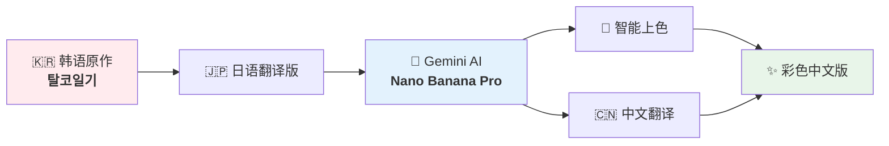
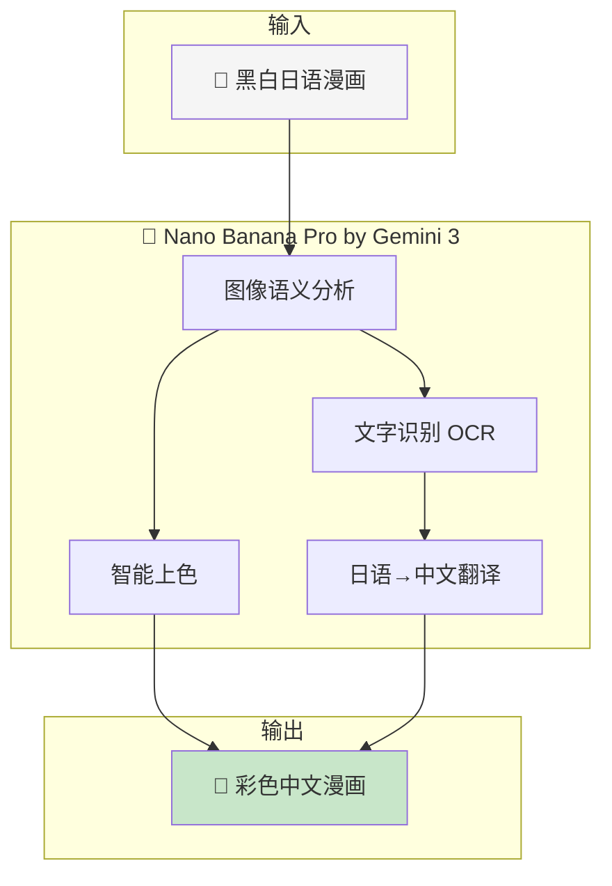
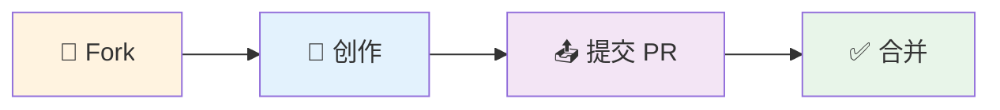

# 🎨 Escape the Corset | 脱束身衣日记

> **用 AI 将韩国女权漫画《탈코일기》重绘为彩色中文版的开源项目**

<p align="center">
  
  
  
</p>

<p align="center">
  <a href="#-在线阅读"><b>📖 在线阅读</b></a> ·
  <a href="#-快速开始"><b>🚀 参与创作</b></a> ·
  <a href="#-参与贡献"><b>🤝 贡献指南</b></a>
</p>

<br>

## 📌 项目概览



**《탈코일기》**（탈=脱离 + 코=Corset + 일기=日记）是一部韩国女权主义漫画，记录女性摆脱社会审美束缚、觉醒自我的心路历程。

> 💡 **"Escape the Corset"** 是韩国 Tal-Corset 运动的官方英译，该运动鼓励女性拒绝被外貌定义。

<br>

---

<br>

## ✨ 核心特色

<table>
<tr>
<td align="center" width="33%"><h3>🤖</h3><b>AI 原生</b><br><sub>Nano Banana Pro by Gemini 3</sub></td>
<td align="center" width="33%"><h3>🎨</h3><b>不止翻译</b><br><sub>上色 + 增强 + 本地化</sub></td>
<td align="center" width="33%"><h3>🌐</h3><b>开源协作</b><br><sub>人人可参与的创作</sub></td>
</tr>
</table>

<br>

---

<br>

## 🛠️ 技术流程



**为什么选择 Nano Banana Pro？**

| 能力 | 说明 |
|:---|:---|
| 🖼️ 图像理解 | 识别漫画结构、人物、场景 |
| 🎨 语义上色 | 根据情感基调生成配色 |
| ✍️ 文字处理 | 精准替换文字，保持排版 |
| 🔄 风格一致 | 保持原作艺术风格 |

<br>

---

<br>

## 🚀 快速开始

只需 **5 步**，即可参与 AI 二次创作：

| 步骤 | 操作 |
|:---:|:---|
| **1** | 打开 [gemini.google.com](https://gemini.google.com/) 并登录 |
| **2** | 上传一张日语版漫画图片 |
| **3** | 粘贴下方提示词 |
| **4** | 等待 AI 生成彩色中文版 |
| **5** | 下载并提交 PR |

**📋 提示词模板：**

```
请帮我将附件图片做精细化处理，比如上色、增加背景和线条等等，
对图片做专业漫画的加工程序，漫画中的日语配文要全部改为中文配文，
使其成为一个专业的漫画。
```

> 💡 **提示**：可根据需要添加「使用明亮配色」「保持原画风」等补充说明。

<br>

---

<br>

## 🤝 参与贡献



**贡献方式：**

| 方式 | 说明 |
|:---|:---|
| 🎨 提交作品 | 处理漫画页面，提交彩色中文版 |
| 🔬 优化 Prompt | 分享更好的提示词技巧 |
| 📖 校对翻译 | 检查翻译准确性 |
| ⭐ Star | 让更多人发现这个项目 |

**文件命名：** `chapter_01_page_05_colored.png`

<br>

> 🌟 **每一份贡献都在推动这个项目前进！**

<br>

---

<br>

## 📖 在线阅读

*🚧 即将上线...*

<br>

---

<br>

## 📚 更多阅读

同类题材推荐：

| 作品 | 信息 |
|:---|:---|
| **《달려가는 여자》** | 跑过去的女性 |
| 原作者 | 누구개 [@someone_fmns](https://x.com/someone_fmns) |
| 日语版 | [@datsukolsaikou](https://x.com/datsukolsaikou/status/1059812512265371652) |

<br>

---

<br>

## 🙏 致谢

| 角色 | 致谢对象 |
|:---|:---|
| 原作者 | 탈코일기계정 [@talco1gi](https://x.com/talco1gi) |
| 日语翻译 | [@datsukolsaikou](https://x.com/datsukolsaikou/status/1277271606302138370) |

<br>

## ⚠️ 免责声明

本项目仅供学习交流，不涉及商业目的。所有漫画版权归原作者 **탈코일기계정** 所有。如有侵权请联系删除，请支持原作者创作。

<br>

---

<p align="center">
  <b>🎨 AI 赋能创作 · 开源连接世界 · 故事跨越语言</b>
</p>

<p align="center">
  <sub>献给每一位勇敢做自己的人 ✨</sub>
</p>
